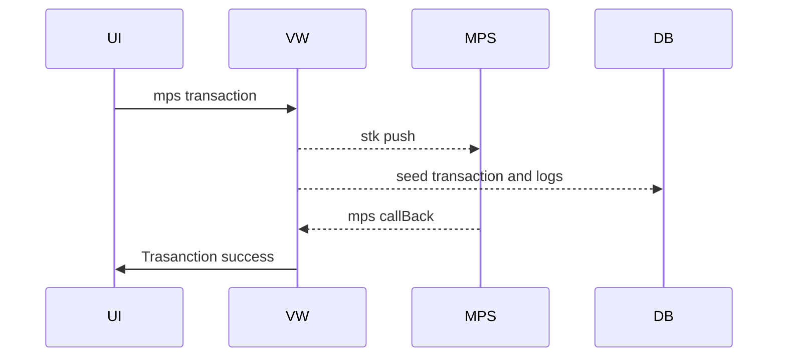

# VW

virtual wallet microservice

### Installation

Vw requires [Node.js](https://nodejs.org/) to run.

Install the dependencies and devDependencies and start the server

```sh
> git clone the repo
> cd vw
> run npm install
> create a .env file,copy .env.example and replace with your configuration
> npm run dev
```

[](https://app.getpostman.com/join-team?invite_code=edfd665f474f383ee545a161c1485a99&target_code=12291a4f448a2e2fd97751a7c36299f9)

## MPS Transaction


